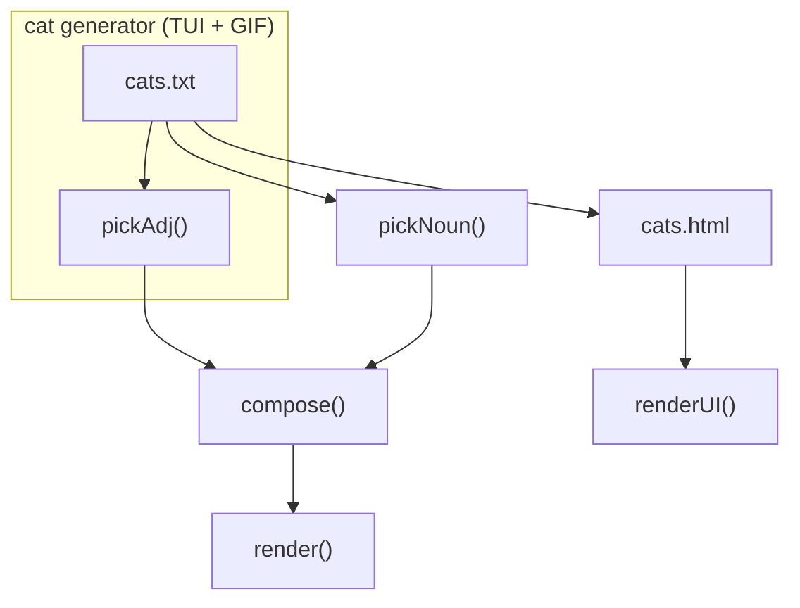

# cats (TUI + GIF)

rev: 16 · updated: 2026-09-08T22:01:55.189Z · generator: agent

## Diagram

## Nodes

| id | shape | label | refs | description |
|---|---|---|---|---|
| n1 | rect | cats.txt | cats.txt | word list, one cat per line |
| n2 | rect | pickAdj() | src/cat.ts | random adjective |
| n3 | rect | pickNoun() | src/cat.ts | random noun |
| n4 | rect | compose() | src/run.ts | adjective + noun = cat name |
| n5 | rect | render() | src/cat.ts, src/gif.ts | TUI cat (stdout) or GIF (file) |
| n6 | rect | cats.html | cats.html | browser UI: generate button + pixel cat |
| n7 | rect | renderUI() | cats.html | inline JS picks adjective+noun, draws ASCII cat |

## Edges

| id | from | to | style | label | description |
|---|---|---|---|---|---|
| e1 | n1 | n2 | solid |  |  |
| e2 | n1 | n3 | solid |  |  |
| e3 | n2 | n4 | solid |  |  |
| e4 | n3 | n4 | solid |  |  |
| e5 | n4 | n5 | solid |  |  |
| e7 | n1 | n6 | solid |  |  |
| e8 | n6 | n7 | solid |  |  |

## Zones

| id | label | description | nodes |
|---|---|---|---|
| z6 | cat generator (TUI + GIF) |  | n1, n2 |

## Sync

_No warnings._
