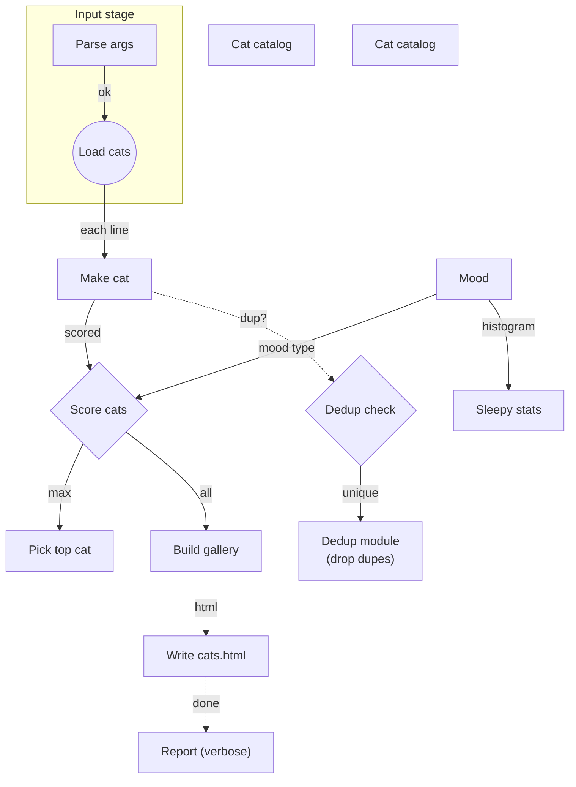

# Cat Gallery Generator

rev: 47 · updated: 2026-09-07T05:40:06.227Z · generator: human-editor

## Diagram

## Nodes

| id | shape | label | refs | description |
|---|---|---|---|---|
| n1 | rect | Parse args | src/args.ts | reads argv into typed Args (input/output/verbose) |
| n2 | circle | Load cats | src/main.ts | reads cats.txt, one 'url\|name' per line |
| n3 | rect | Make cat | src/cat.ts | wraps a source+name into a Cat (kind: url\|file) |
| n4 | diamond | Score cats | src/score.ts | rates cats 0..100 and stamps mood (happy\|sleepy) |
| n5 | rect | Pick top cat | src/top.ts | head of the sorted top-list |
| n6 | square | Build gallery | src/gallery.ts | standalone pixel-styled HTML page: card per cat with mood stamp and score |
| n7 | rect | Write cats.html | src/write.ts | writes the gallery to disk |
| n8 | rect | Report (verbose) | src/report.ts | verbose-only summary line |
| n9 | rect | Sleepy stats | src/stats.ts | mood histogram, verbose-only optional branch |
| n10 | rect | Mood | src/mood.ts | mood type shared by score/caption/stats |
| n11 | table | Cat catalog |  | demo table: the scored catalog as rendered by the table shape (max 10 cols x 50 rows) |

**n11 columns:** name · src kind · score · mood
> n11 | Mursik | url | 57 | happy |
> n11 | Barsik | url | 57 | happy |
> n11 | Murka | url | 43 | happy |
> n11 | Pirog | file | 26 | sleepy |
| n12 | diamond | Dedup check |  | human added: drop duplicate cats |
| n13 | rect | Dedup module (drop dupes) | src/dedup.ts | filters duplicate cats by name |
| n14 | table | Cat catalog |  | scored catalog as a table shape (10 cols x 50 rows max) |

**n14 columns:** name · kind · score · mood
> n14 | Mursik | url | 57 | happy |
> n14 | Barsik | url | 57 | happy |
> n14 | Murka | url | 43 | happy |
> n14 | Pirog | file | 26 | sleepy |

## Edges

| id | from | to | style | label | description |
|---|---|---|---|---|---|
| e1 | n1 | n2 | solid | ok |  |
| e2 | n2 | n3 | solid | each line |  |
| e3 | n3 | n4 | solid | scored |  |
| e4 | n4 | n5 | solid | max |  |
| e5 | n4 | n6 | solid | all |  |
| e6 | n6 | n7 | solid | html |  |
| e7 | n7 | n8 | dashed | done |  |
| e10 | n10 | n4 | solid | mood type |  |
| e11 | n10 | n9 | solid | histogram |  |
| e12 | n3 | n12 | dashed | dup? |  |
| e13 | n12 | n13 | solid | unique |  |

## Zones

| id | label | description | nodes |
|---|---|---|---|
| z9 | Input stage | args and cat list | n1, n2 |

## Sync

- [orphan] node n11 ("Cat catalog") has no edges
- [orphan] node n14 ("Cat catalog") has no edges
